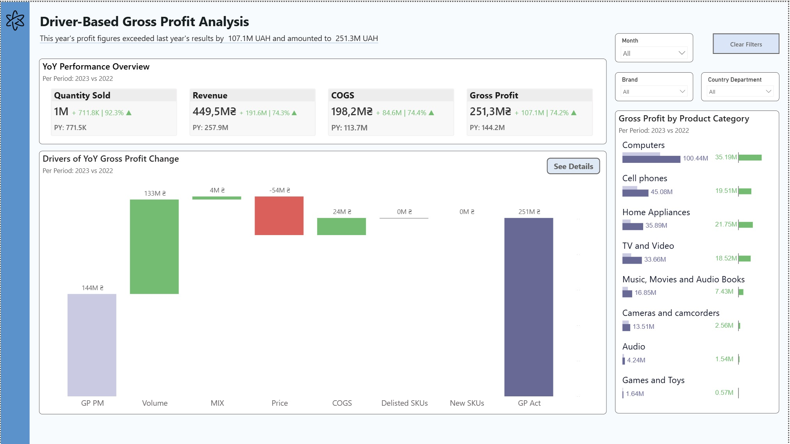
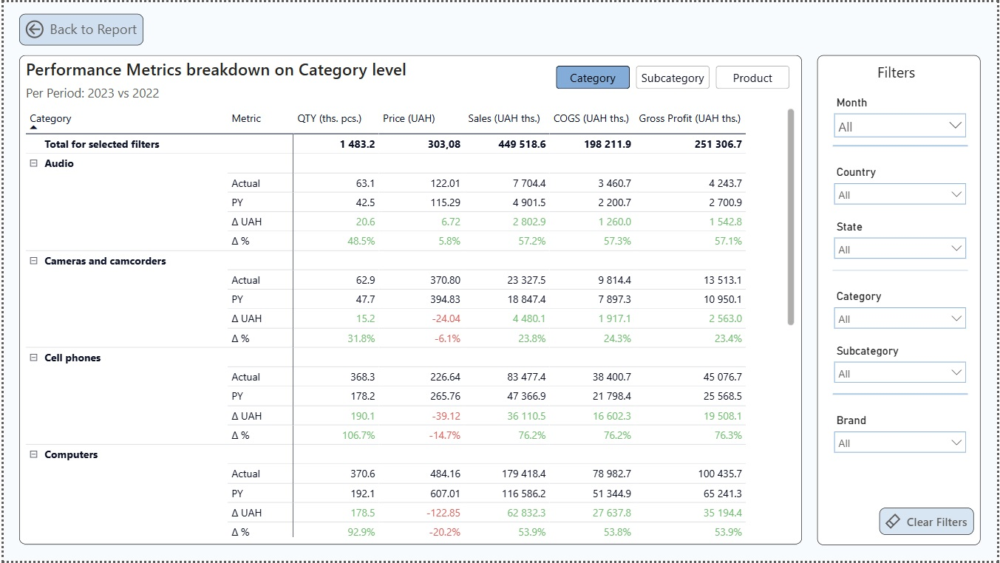

# Driver-Based Gross Profit Analysis (Power BI)

## 📌 Business Overview
This Power BI dashboard provides a detailed breakdown of Year-over-Year (YoY) Gross Profit performance, identifying core business drivers such as Volume, Mix, Price, COGS, Delisted SKUs, and New SKUs. 

**Key Insight:** This year's profit figures exceeded last year's results by **+107.1M UAH**, reaching a total of **251.3M UAH** (+74.2% YoY growth).

---

## 📊 Visual Highlights



---

## 🔑 Key Features & KPI Metrics

* **YoY Performance Tracking:** Real-time tracking of Quantity Sold, Revenue, COGS, and Gross Profit against Prior Year (PY) benchmarks.
* **Variance & Driver Decomposition:** Waterfall chart visualising contribution factors to YoY Gross Profit change:
  * **Gross Profit Prior Margin (GP PM)**
  * **Volume Impact**
  * **Product Mix Impact**
  * **Price Variance**
  * **COGS Impact**
  * **Portfolio Changes:** Delisted SKUs vs. New SKUs
* **Dynamic Slicers:** Filtering by Month, Brand, and Country/Department.

---

## 🛠️ Technical Stack & Data Modeling

* **Tool:** Power BI Desktop
* **Data Sources:** https://github.com/sql-bi/Contoso-Data-Generator-V2-data/releases/tag/ready-to-use-data
* **DAX Techniques:** Time Intelligence functions, driver-decomposition DAX calculations, and dynamic formatting.

---

## 📂 Repository Contents

* `assets/`: High-resolution dashboard screenshots.
* `src/`: Measures files.

---

## 🚀 How to Open
1. Clone this repository:
   ```bash
   git clone https://github.com/DubovykVitaliy/driver-based-gross-profit-analysis.git
   ```
2. Open the `Factor Analysis.pbix` file in **Power BI Desktop**.

---
